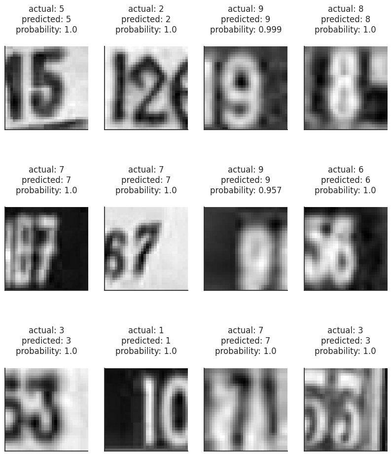
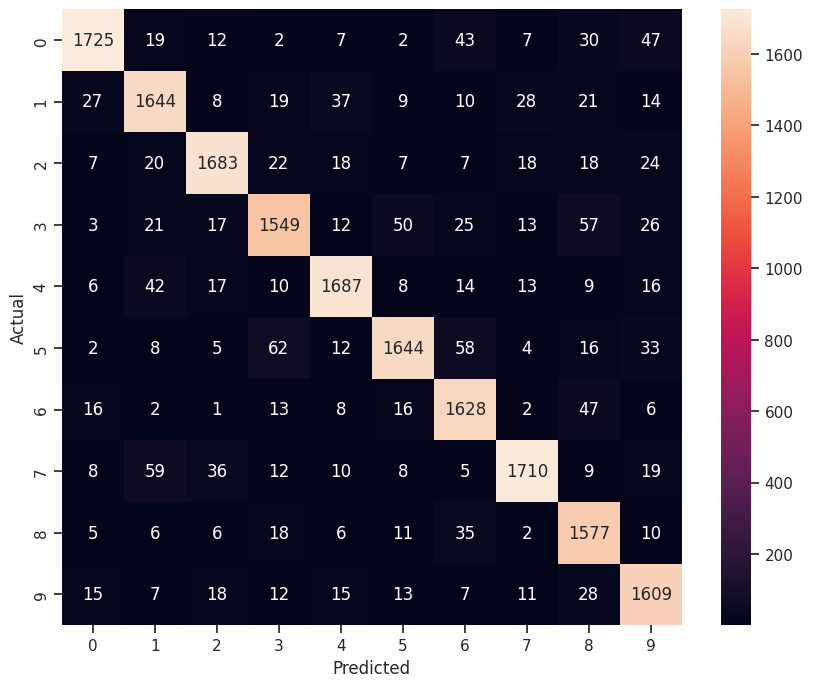

# Street View Housing Number Digit Recognition
</img>

The SVHN dataset contains over 600,000 labeled digits cropped from street-level photos. It is one of the most popular image recognition datasets. It has been used in neural networks created by Google to improve the map quality by automatically transcribing the address numbers from a patch of pixels. The transcribed number with a known street address helps pinpoint the location of the building it represents.

## Objective

This is the elective project of the Applied Data Science Program of MIT Professional Education. Our objective is to predict the number depicted inside the image by using Artificial or Fully Connected Feed Forward Neural Networks and Convolutional Neural Networks. We will go through various models of each and finally select the one that is giving us the best performance.

## Dataset

Here, we will use a subset of the original data to save some computation time. The dataset is provided as a .h5 file. The basic preprocessing steps have been applied on the dataset. The dataset has 2 sub-sets, train and test. Trainin set has 42,000 images and the test has 18,000 images. Each image is size of 32x32 and has only 1 channel (grayscale). You may see the firts 10 labels (digits) in the training set below.

</img>

As you can see in the below count plot, the number of each digit in the training dataset are quit similar to the eachother. That's why it's safe to highlight that the trainin set is balanced. This allow us to we can only focus on the accuracy score metric.

</img>

## Model Building
After applying rescaling the images by dividing the array values by 255 and label encoding to the classes, we built several ANN models including networks without CNN. You may see the number of trainable parameters and their accuracy scores in the below table. All models are trains with 20 epochs.

|Model Name        |# of Trainable Parameters|Accuracy Score (%)|
|-----------------:|:------------:|:------------:|
|Baseline ANN Model|285,482|      65.44   |
|First CNN Model|267,306|87.08|
|Second CNN Model|164,170|91.42|

First CNN suffered from overfitting. To tackle this problem, we added BatchNormalization layers and added 50% Dropout layer to the fully connected layers. We also increase the number of CNN layers so the model not to loose it's generalization ability. You may see some randomly selected predictions on the test set in the below image.

</img>

Classification report shows that The recall has not a high range which implies that the model is good at identifying almost all digits.
The highest precision is for digits 6 and 8 which implies that the model can distinguish these digits from other objects. On the other hand, the lowest precision values are for digit 3 and digit 5 which can easily be noticed on below the confusion matrix too.

</img>

## Conclusion

In this project we tried to create a deep learning model which would allow us to recognize digits from the housing number images. To achieve this goal we used the 48K of the total 60K images for training of the model and remaining 12K to check the performance of the model. We tried to solve this problem first by using densely connected models (DNN). We developed 2 different models. The latter model was more complex than the first one relatively. However, the overall performance of these models was poor when you compare it to the convolutional neural network (CNN) models. The first CNN model performed better than DNN models however it suffered from overfitting. We solved this problem by adding some regularization methods such as `BatchNormalization` and `Dropout` layers. Additionaly, we add more convolutional layers so the model could be better on feature extraction.

There is still plenty of scope for improvement and you can try out tuning different hyperparameters to improve the model performance.
