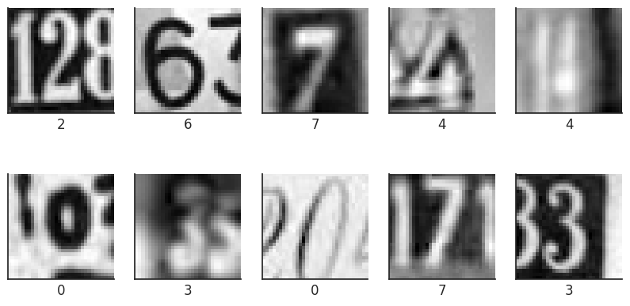

# Street View Housing Number Digit Recognition
</img>

The SVHN dataset contains over 600,000 labeled digits cropped from street-level photos. It is one of the most popular image recognition datasets. It has been used in neural networks created by Google to improve the map quality by automatically transcribing the address numbers from a patch of pixels. The transcribed number with a known street address helps pinpoint the location of the building it represents.

## Objective

This is the elective project of the Applied Data Science Program of MIT Professional Education. Our objective is to predict the number depicted inside the image by using Artificial or Fully Connected Feed Forward Neural Networks and Convolutional Neural Networks. We will go through various models of each and finally select the one that is giving us the best performance.

## Dataset

Here, we will use a subset of the original data to save some computation time. The dataset is provided as a .h5 file. The basic preprocessing steps have been applied on the dataset. The dataset has 2 sub-sets, train and test. Trainin set has 42,000 images and the test has 18,000 images. Each image is size of 32x32 and has only 1 channel (grayscale). You may see the firts 10 labels (digits) in the training set below.

</img>

</img>
